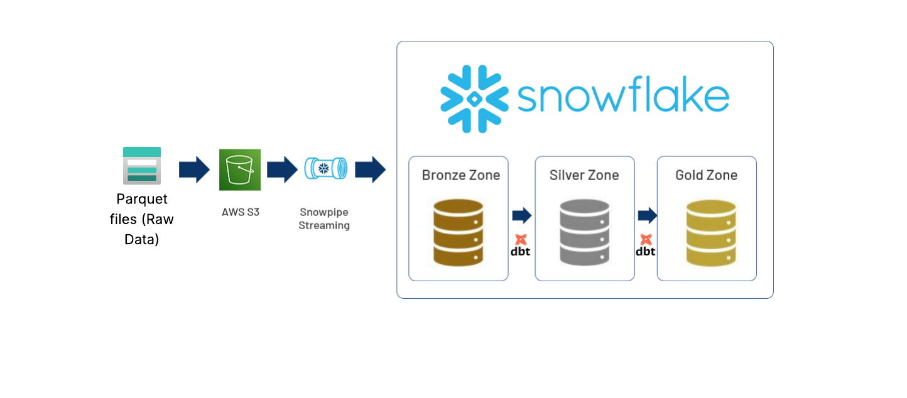
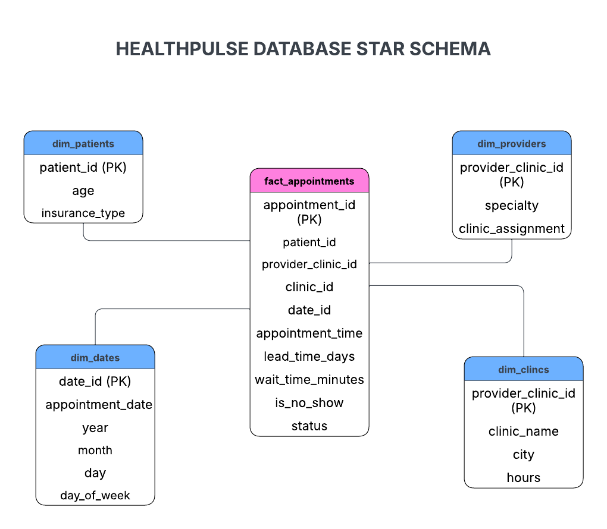

# Amdari HealthPulse – Healthcare Appointments Data Warehouse

A modern data warehouse project demonstrating end-to-end data ingestion, transformation, and modeling using Snowflake, dbt, and AWS. The solution follows a structured Medallion architecture.

## Overview
Amdari HealthPulse is a data engineering project that builds a healthcare appointments data warehouse using Snowflake and dbt. The project demonstrates how raw healthcare appointment data can be ingested, transformed, and modeled into an analytical data warehouse following a layered architecture.

The project includes two ingestion approaches:
- Manual pipeline implemented with Python and SQL notebooks
- Automated Snowflake pipeline using AWS S3 and Snowpipe

Both pipelines ultimately transform data through Bronze → Silver → Gold layers to produce analytics-ready tables.

---

## Tech Stack
- Snowflake – Cloud data warehouse
- dbt (Data Build Tool) – Data transformation and testing
- AWS S3 – Cloud storage for raw data ingestion
- Python – Data ingestion and preprocessing
- SQL – Data transformations and modeling

---

## Architecture Overview
The project follows a modern data warehouse architecture.

Raw data is ingested either through a manual ingestion pipeline or an automated Snowpipe pipeline, then transformed using dbt into structured analytical models.

---

## Data Warehouse Layers

### 🥉 Bronze Layer – Raw Data Ingestion
The Bronze layer stores raw ingested data with minimal transformation. Data types are initially stored as strings to preserve source data and allow validation in later stages.

### 🥈 Silver Layer – Data Cleaning & Standardization
The Silver layer performs data cleaning and standardization, including:
- Data type validation
- Null handling
- Basic data quality checks

### 🥇 Gold Layer – Star Schema Modeling
The Gold layer contains analytics-ready models structured as a star schema, including fact and dimension tables used for reporting and analysis.

The fact table contains foreign keys referencing the dimension tables and stores business-relevant appointment metrics.

Both Silver and Gold models are configured using dbt’s incremental materialization to prevent full table replacement and ensure scalability.

---

## Data Quality and Testing
Data quality checks are implemented using dbt tests defined in `silver_test.yml` and `gold_test.yml` files.

Tests include Schema validation, uniqueness, referential integrity, and domain checks

These tests ensure:
- Primary keys are unique
- Foreign keys reference valid dimension records

---

## Project Structure
Key components of the repository include:

- pipelines/manual_pipeline/ – Notebook-based manual ingestion pipeline
- pipelines/snowpipe_pipeline/ – Snowflake Snowpipe ingestion setup
- models/ – dbt transformations for Silver and Gold layers
- docs/ – Architecture diagrams and data dictionary
- macros/ – dbt macros used across models

Each folder contains its own README with detailed execution steps.

---

### Resources:
- Learn more about dbt [in the docs](https://docs.getdbt.com/docs/introduction)
- Learn more about Snowflake [in the docs](https://docs.snowflake.com/en/)
- Learn more about AWS S3 [in the docs](https://docs.aws.amazon.com/AmazonS3/latest/userguide/Welcome.html)

